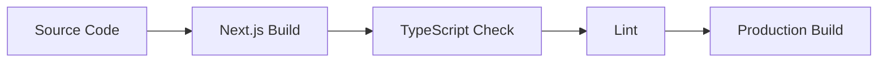

# Architecture and Development Patterns

## Core Architecture Principles

### 1. Component Organization
- **Feature-First Structure**: Components are organized by feature rather than type
- **UI Component Isolation**: Reusable UI components are kept in `/components/ui`
- **Composition Pattern**: Complex components are built by composing smaller ones

### 2. State Management
- **React Context**: Used for global state (audio, theme)
- **Local State**: Component-specific state using useState/useReducer
- **Custom Hooks**: Encapsulate complex state logic and side effects

### 3. Audio Processing Pattern
```
Audio Flow:
[audio-provider.tsx] → [audio-processor.ts (Worker)] → [visualization-renderer.ts]
                    ↓
            [audio-player.tsx]
```

### 4. Performance Patterns
- Web Workers for intensive tasks
- Lazy loading for routes and components
- Optimized audio visualization
- Debounced event handlers

## Development Patterns

### 1. Component Creation Guidelines
- Prefer functional components
- Use TypeScript interfaces for props
- Implement error boundaries where needed
- Follow atomic design principles

### 2. Styling Approach
- Tailwind CSS for utility-first styling
- CSS modules for complex animations
- CSS variables for theming
- Mobile-first responsive design

### 3. Error Handling
- Error boundaries for component failures
- Try-catch for async operations
- Fallback UI components
- Graceful degradation

### 4. Testing Strategy
- Component unit tests
- Integration tests for audio features
- Performance monitoring
- Accessibility testing

## Environment Setup

### Development Environment
- Windows OS specific configurations
- PowerShell commands and scripts
- Node.js and npm settings
- IDE configurations

### Build Process


## Common Patterns by Feature

### 1. Audio Features
- Stream handling with Web Audio API
- Buffering strategies
- Visualization optimization
- Audio state management

### 2. UI Components
- Consistent prop patterns
- Event handler naming
- Loading states
- Error states

### 3. Data Flow
```
Data Flow Pattern:
[Data Source] → [Provider] → [Hooks] → [Components]
```

## Project-Specific Conventions

### 1. File Naming
- Components: PascalCase.tsx
- Utilities: kebab-case.ts
- Hooks: use[Name].ts
- Types: [Name].types.ts

### 2. Import Organization
```typescript
// Standard import order
import { type } from 'library'
import { component } from '@/components'
import { util } from '@/utils'
import { hook } from '@/hooks'
import { style } from './style'
```

### 3. Component Structure
```typescript
// Standard component structure
import { dependencies }
import { types }
import { styles }

interface Props {
  // Props definition
}

export function Component({ props }: Props) {
  // Hooks
  // State
  // Effects
  // Handlers
  // Render
}
```

## Common Issues and Solutions

### 1. Audio Processing
- High CPU usage: Use Web Workers
- Memory leaks: Proper cleanup in useEffect
- Mobile compatibility: Platform-specific code

### 2. Performance
- Large bundle sizes: Code splitting
- Render optimization: useMemo/useCallback
- Image optimization: Next.js Image component

### 3. State Management
- Complex state: Custom hooks
- Prop drilling: Context API
- Side effects: Proper cleanup

## Development Workflow

### 1. Feature Development
1. Plan component structure
2. Create types and interfaces
3. Implement core functionality
4. Add error handling
5. Optimize performance
6. Add tests

### 2. Code Review Guidelines
- TypeScript strict mode compliance
- Performance considerations
- Error handling coverage
- Mobile responsiveness
- Accessibility compliance

## Future Considerations

### 1. Planned Features
- Offline support
- PWA capabilities
- Social features
- Advanced audio processing

### 2. Technical Debt
- Areas needing refactoring
- Performance improvements
- Test coverage gaps
- Documentation updates 